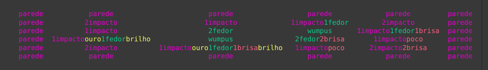
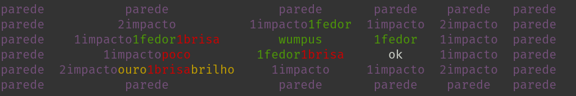

# Mundo de Wumpus

Esta é uma solução para o problema do [mundo de wumpus](https://www.ime.usp.br/~leliane/IAcurso2000/Wumpus.html) utilizando [agente baseado em conhecimento](http://www.inf.ufsc.br/~alexandre.goncalves.silva/courses/14s2/ine5633/slides/aula1021.pdf) e [solver](https://pysathq.github.io/usage/).

O código **ainda está sendo refatorado**, mas já é funcional. Pode ser executado no *main.py* ou em *Mundo_de_Wumpus.ipynb* (recomendado).

Para executar *main.py*, certifique-se de possuir os pré-requisitos:
* tabulate - pip install tabulate
* colorama - pip install colorama
* pysat.solvers - pip install python-sat
* sqlite3 - pip install db-sqlite3

## Sobre a implementação do mapa:

Mais externamente temos a parede e, adjacente a ela, o agente pode sentir impacto. Do mesmo modo para wumpus e fedor, poço e brisa. O brilho só pode ser sentido caso o agente esteja na mesma posição que o ouro.

Note que nem sempre o problema poderá ser satisfeito, por exemplo:
* Pode não haver ouro;
* Agente pode ser cercado por poços/wumpus;
* Caso esteja cercado por fedores/brisas, haverá incertezas onde podem estar poços/wumpus
## Sobre as equivalências lógicas:

Consulte o [pdf no repositório](/Equival%C3%AAncias%20L%C3%B3gicas.pdf), nele, para cada informação que o agente pode adicionar ao solver, temos um modelo lógico convencional (semelhante ao pensamento lógico comum) e um modelo na forma normal conjuntiva simplificado (naturalmente o solver irá ler na fnc), por exemplo:
* O agente, ao informar que em certa posição há fedor, será inserido ao solver que:
    * Naquela posição há fedor (*p*)
    * Adjacente aquela posição há wumpus com um modelo lógico convencional {*(c&-e&-b&-d)#(-c&e&-b&-d)#(-c&-e&b&-d)#(-c&-e&-b&d)*}
    * Adjacente aquela posição há wumpus com um modelo na fnc {*(-c#-e), (-c#-b), (-c#-d), (-e#-b), (-e#-d), (-b#-d)*}

## Bug ;(
Há um bug: agente não consegue, por conta própria, inferir não haver parede na parte interna do mapa. Para resolver isso há um "remédio" na função regrasDoMapa() do solver.